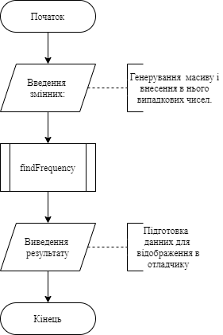
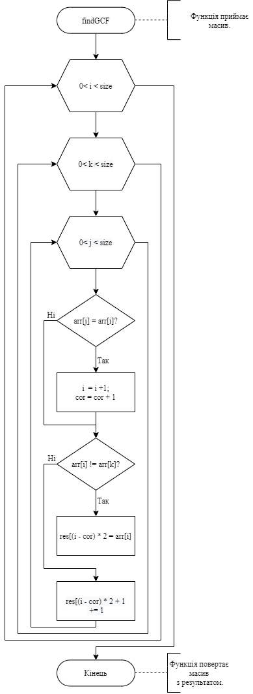
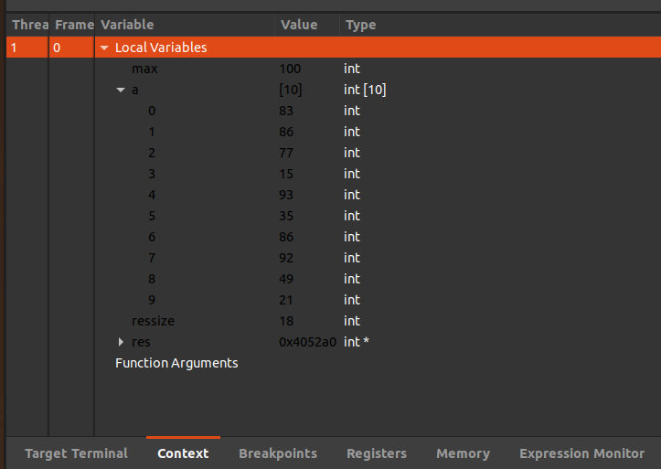
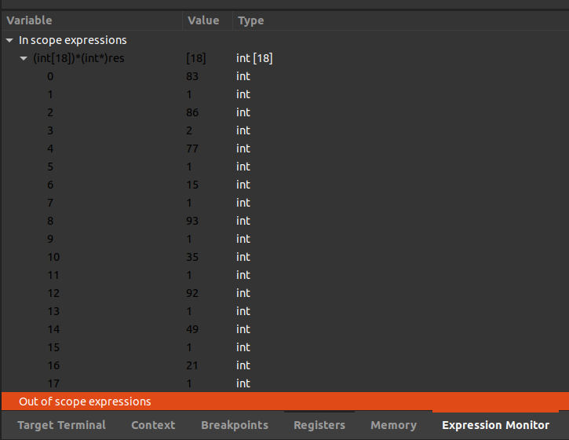

# Лабораторна робота №11. Вступ до показчиків.
## Вимоги:
* *Розробник*: Зозуля Ігор студент группи КІТ-120а.
* *Загальне завдання*: Реалізувати программи з використанням функцій.
* *Індивідуальне завдання* : Визначити частоту зустрічання певного елементу в масиві.
## Опис програми:
* *Функціональне призначення* : Визначення найбільшого спільного множника для двох чисел. Всі елементи мають однаковий знак і ціле значення.

* *Опис логічної структури* :
   * Функція `main`. Задає мансимальне значення числа для запису в масив, масив та його розміри, і передає все до функції findFrequency. Схема алгоритму функції:

     

   * Функція `findGCF`. Знаходить частоту зустрічання певного елементу в масиві. Параметри: a - перше число; b - друге число; div - НСД. Схема алгоритму функції:

     

* *Структура програми*:
```
.
├── doc
│   ├── assets
│   ├── Lab11.md
│   └── Lab11.pdf
├── Doxyfile
├── Makefile
├── task01
│   └── src
│       ├── lib.c
│       ├── lib.h
│       └── main.c
```
* *Важливі елементи програми*:
   * Формування змінних. Масив з випадковими числами.

   ``` () {
        #define SIZE 10
        int max = 100;
        int a[SIZE];
        for (int i = 0; i < size; i++) {
                arr[i] = rand() % max;
        }
   ```
   *  Виконання алгоритму визначення частоти повторюваності елементів.
   ```
   int cor = 0;
        for (int i = 0; i < size; i++) {
                for (int k = 0; k < size; k++) {
                        for (int j = i - 1; j > 0; j--){
                                if (arr[j] == arr[i]) {
                                        i++;
                                        cor++;
                                }
                        }
                        if (arr[i] != arr[k]) {
                                *(res + (i - cor) * 2) = arr[i];
                        }else{
                                *(res + ((i - cor) * 2) + 1) += 1;
                        }
                }
        }
   ```
## Варіанти використання:
З допомогою відлогаднику ставимо точку зупинки на строках визову функції (для визначення початкового стану змінних)  та `return 0;` (для визначення стану змінних).
Виклик функції `findFrequency` з початковими данними:



Після знаходження частоти зустрічання чисел:



## Висновки:
Для виконання лабораторної роботи я навчився реалізовувати алгоритми функції, та використовувати показчики.
