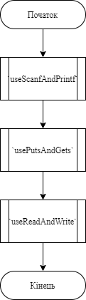
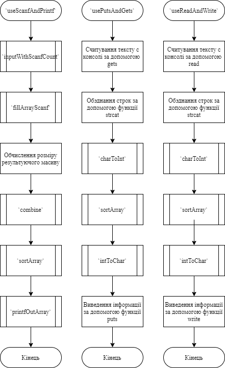
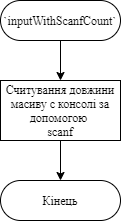
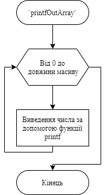
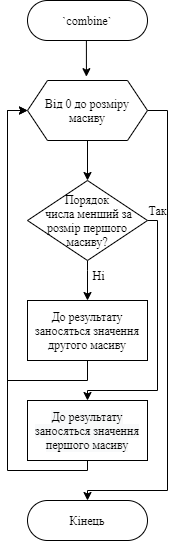
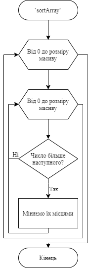
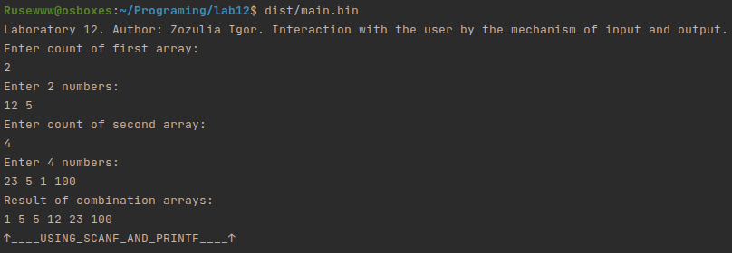

# Лабораторна робота №12.  Взаємодія з користувачем шляхом механізму введення/виведення.
## Вимоги:
* *Розробник*: Зозуля Ігор студент группи КІТ-120а.
* *Загальне завдання*: Реалізувати программу з використанням механізму введення/виведення.
* *Індивідуальне завдання* : Продемонструвати взаємодію з користувачем шляхом використання printf(), scanf(), gets(), puts(), read(), write().
## Опис програми:
* *Функціональне призначення* : Програма приймає дві строки чисел за допомогою функцій вводу, обєднує їх та сортує від меншого до більшого, виводить ці числа за допомогою функцій виведення.

* *Опис логічної структури* :
   * Функція `main`. Викликає функції `useScanfAndPrintf`, `usePutsAndGets`, `useReadAndWrite`. Схема алгоритму функції:

     

   * Функції `useScanfAndPrintf`, `usePutsAndGets`, `useReadAndWrite`. Считують і виводять інформацію за допомогою функцій printf(), scanf(), gets(), puts(), read(), write(), а також викликають функцію. `sortArray`. Схема алгоритмів функцій:

     
       
   * Функція `inputWithScanfCount`. Считуютє довжину масиву за допомогою функції scanf(). Схема алгоритмів функцій:

     
  
   * Функції `printfOutArray`. Виводить масив за допомогою функції printf().Схема алгоритмів функцій:

      
  
   * Функції `combine`. Обєднує два масиви чисел в один.Схема алгоритмів функцій:

     
  
   * Функції `sortArray`. Сортує масив від більшого числа до меншого.Схема алгоритмів функцій:

     
* *Структура програми*:
```
.
├── doc
│   ├── assets
│   │   ├── charToInt.png
│   │   ├── combine.png
│   │   ├── fillArrayScanf.png
│   │   ├── inputWithScanfCount.png
│   │   ├── intToChar.png
│   │   ├── lab12.drawio
│   │   ├── mainFunction.png
│   │   ├── main.png
│   │   ├── printfOutArray.png
│   │   ├── run_program.png
│   │   └── sortArray.png
│   └── lab12.md
├── Doxyfile
├── Makefile
├── README.md
└── src
    ├── lib.c
    ├── lib.h
    └── main.c

```
* *Важливі елементи програми*:
   *  Підключення заголовочного файлу. Підключаємо заголовочний файл `string.h`.

   ```
   #include <string.h>
   ```
   *  Считування масиву з потоку вводу. Считуємо посимвольно масив за допомогою `printf()`.
   ```
	for (int i = 0; i < count; i++) {
		fscanf(stdin, "%d", &arr[i]);
	}
   ```
    *  Виведення масиву до консолі. Виводимо посимвольно масив за допомогою `scanf()`.
   ```
	for (int i = 0; i < count; i++) {
		printf("%d ", arr[i]);
	}
   ```
## Варіанти використання:
Программа считує інформацію з потоку вводу, та відображує результат виконання в консолі:



## Висновки:
В результаті виконання лабораторної роботи я навчився створювати программи з використанням механізму введення/виведення.
