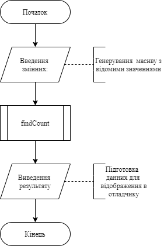
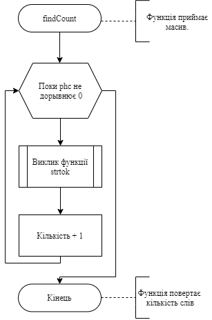
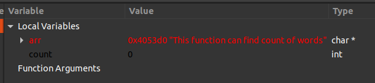
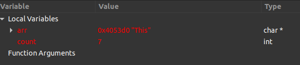

# Лабораторна робота №13. Строки.
## Вимоги:
* *Розробник*: Зозуля Ігор студент группи КІТ-120а.
* *Загальне завдання*: Реалізувати программи з використанням функцій.
## Опис програми:
* *Функціональне призначення* : Визначити кількість слів без іттераціі по кожному символу.

* *Опис логічної структури* :
   * Функція `main`. Задає масив, його розміри та значення і передає все до функції findCount. Схема алгоритму функції:

     

   * Функція `findGCF`. Знаходить кількість слів Параметри: arr - заданий масив; count- кількість слів; keys - ключ для виконання вункії; phc - допомідний масив. Схема алгоритму функції:

     

* *Структура програми*:
```
.
├── doc
│   ├── assets
│   ├── Lab13.md
│   └── Lab13.pdf
├── Doxyfile
├── Makefile
├── task01
│   └── src
│       ├── lib.c
│       ├── lib.h
│       └── main.c
```
* *Важливі елементи програми*:
   * Формування змінних. Масив з попередньо відомими значеннями.

   ``` #define SIZE 37
        char* arr = (char*)malloc(SIZE * sizeof(char*));
        arr = strdup("This function can find count of words");
   ```
   *  Виконання алгоритму визначення кількості слів.
   ```
   char keys[] = {" "};
        int count = 0;
        char * phc = strtok(arr, keys);
        while (phc != NULL) {
                phc = strtok(NULL, keys);
                count++;
        }
   ```
## Варіанти використання:
З допомогою відлогаднику ставимо точку зупинки на строках визову функції (для визначення початкового стану змінних)  та `return 0;` (для визначення стану змінних).
Виклик функції `findFrequency` з початковими данними:



Після знаходження частоти зустрічання чисел:



## Висновки:
Для виконання лабораторної роботи я навчився реалізовувати алгоритми функції, та працювати зі строками.
