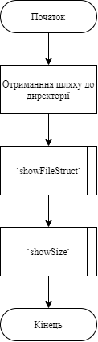

# Лабораторна робота №14. Взаємодія з файлами.
## Вимоги:
* *Розробник*: Зозуля Ігор студент группи КІТ-120а.
* *Загальне завдання*: Розробити программу яка виводить структуру каталогу, та демонструє його розмір.
* *Індивідуальне завдання* : Переробити программу розроблену в попередній лабораторній роботі з використанням функцій scanf(), printf().
## Опис програми:
* *Функціональне призначення* : Виведення структури та розміру запитуваного каталогу.

* *Опис логічної структури* :
   * Функція `main`. Отримує шлях до каталогу та предає данні до функцій `showFileStruct`,`showSize`. Схема алгоритму функції:

     

   * Функція `showFileStruct`. Виводить структуру заданого каталогу. Схема алгоритму функції:

     
  
   * Функція `showSize`. Виводить розмір заданого каталогу в Кб. Схема алгоритму функції:

     

* *Структура програми*:
```
.
├── assets
│   └── input.txt
├── doc
│   ├── assets
│   │   ├── lab14.drawio
│   │   ├── main.png
│   │   ├── run.png
│   │   ├── showFileStruct.png
│   │   └── showSize.png
│   └── lab14.md
├── Doxyfile
├── Makefile
├── README.md
└── src
    ├── lib.c
    ├── lib.h
    └── main.c
```
* *Важливі елементи програми*:
   * Отрипання каталогу. Отримуємо шлях до каталогу за допомогою функції scanf().

   ```
   scanf("%256s", directory);
   ```
   *  Отримання шляху до внутрішніх файлів та виведення структури.
   ```
   if (strcmp(entry->d_name, ".") != 0 && strcmp(entry->d_name, "..") != 0) {
				printf("%*c", spaceCount, ' ');
				printf("%s\n", entry->d_name);
				char *fullIneName = (char *)calloc(strlen(directory) + 1 + strlen(entry->d_name), sizeof(char) + 1);
				strncat(fullIneName, directory, strlen(directory) + strlen(entry->d_name));
				strncat(fullIneName, "/", strlen(directory) + strlen(entry->d_name));
				strncat(fullIneName, entry->d_name, strlen(directory) + strlen(entry->d_name));
				showFileStruct(fullIneName, spaceCount + 2);
				free(fullIneName);
	}
   ```
## Варіанти використання:
Программа считує інформацію з потоку вводу, та відображує результат виконання в консолі:


## Висновки:
У ході виконання лабораторної роботи я навчився реалізовувати программу яка виводить структуру каталогу, та демонструє його розмір.
