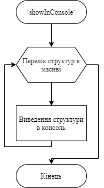

# Лабораторна робота №15. Структуровані типи даних.
## Вимоги:
* *Розробник*: Зозуля Ігор студент группи КІТ-120а.
* *Загальне завдання*: Створити структуру, що відображає "базовий клас".
* *Індивідуальне завдання* : Розробити функції:
    1. Яка читає данні з файлу;
    2. Яка записує данні у файл;
    3. Яка виводить масив елементів на єкран;
    4. Яка буде сортувати масив за заданим критерієм;
    5. Яка виводить всі єлементи з ціною меншою за задану.
    6. Яка генерує елемент прикладної галузі.
## Опис програми:
* *Функціональне призначення* : Взаємодія з єлементами прикладної галузі.

* *Опис логічної структури* :
   * Функція `main`. Заповнює масив структур данними, які знаходяться у файлі, викликом функції `readFromFile`, сортує їх по критерію за  допомогою функції `sortWithCriterion`, виводить данні у консоль функцією `showInConsole`, генерує випадкову структуру - `randomWatch`, записує результат виконанння у файл - `writeToFile`. Схема алгоритму функції:

     

   * Функція `readFromFile`. Читає данні з файлу "input.txt" і записує їх до масиву структур. Схема алгоритму функції:

     
     
   * Функція `sortWithCriterion`. Сортує масив за заданим критерієм (вартість, вологостійкість, стиль та виробник). Схема алгоритму функції:

     

   * Функція `showInConsole`. Виводить зміст масиву структур у консоль. Схема алгоритму функції:

     

   * Функція `randomWatch`. Генерує випадкову структуру классу годинник. Схема алгоритму функції:

     

   * Функція `writeToFile`. Записує зміст масиву структур у файл. Схема алгоритму функції:

     
* *Структура програми*:
```
.
├── assets
│   └── input.txt
├── doc
│   ├── assets
│   │   ├── func.png
│   │   └── lab15.drawio
│   └── lab15.md
├── Doxyfile
├── Makefile
├── README.md
└── src
    ├── lib.c
    ├── lib.h
    └── main.c

```
* *Важливі елементи програми*:
   * Виділення пам`яті для масиву структур:

   ```
   struct watch **watchs = malloc((unsigned long)count * sizeof(struct watch));
	for (int i = 0; i < count; i++) {
		*(watchs + i) = malloc(sizeof(struct watch));
	}
   ```
   * Знаходження всіх годинників ціна яких менша, або дорівнює заданій:
   ```
   for (int j = 0; j < count - 1; j++) {
		if ((*(fCost + j))->cost <= maxCost) {
			if ((*(fCost + j))->waterproof == 1) {
				printf("Waterproof: have\n");
			} else {
				printf("Waterproof: no\n");
			}
			fprintf(stdout, "Model: %s\nCost: %dUSD\nManufacturer: %s, %s\n", ((*(fCost + j))->model), ((*(fCost + j))->cost),
				((*(fCost + j))->manufacturer.firm), ((*(fCost + j))->manufacturer.country));
			if ((*(fCost + j))->style == CLASSIC) {
				fprintf(stdout, "Style: classic\n");
			} else if ((*(fCost + j))->style == SPORT) {
				fprintf(stdout, "Style: sport\n");
			} else {
				fprintf(stdout, "Style: armoured\n");
			}
			printf("\n");
		}
	}
   ```
## Варіанти використання:
Для показання результатів роботи програми можна використовувати IDE CLion або консоль системи Linux. Запуск програми та сортування масиву за ціною:


Виведення годинників ціна яких менша за 400:


## Висновки:
В результаті виконання роботи я начився працювати зі структурованими типами даних.
