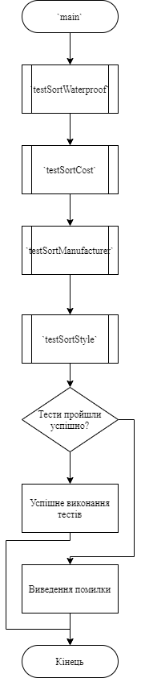
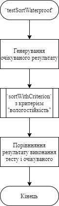
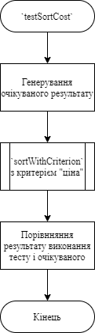
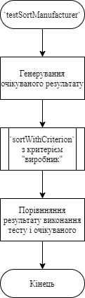
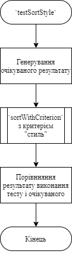
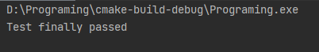

# Лабораторна робота №17. Модульні тести.
## Вимоги:
* *Розробник*: Зозуля Ігор студент группи КІТ-120а.
* *Загальне завдання*: Створити модульні тести до попредньо розлобленого функціоналу.
* *Індивідуальне завдання* : Протестувати функцію `sortWithCriterion`.
## Опис програми:
* *Функціональне призначення* : Тест роботи функцій розроблених в попередній лабораторній роботі.

* *Опис логічної структури* :
    * Функція `main`. Викликає функції тестування. Схема алгоритму функції:

      

    * Функція `testSortWaterproof`. Викликає функцію `sortWithCriterion` з критерієм "waterproof". Схема алгоритму функції:

      

    * Функція `testSortCost`. Викликає функцію `sortWithCriterion` з критерієм "cost". Схема алгоритму функції:

      

    * Функція `testSortManufacturer`. Викликає функцію `sortWithCriterion` з критерієм "manufacturer". Схема алгоритму функції:

      

    * Функція `testSortStyle`. Викликає функцію `sortWithCriterion` з критерієм "style". Схема алгоритму функції:

      
    
* *Структура програми*:
```
.
├── assets
│   └── input.txt
├── doc
│   ├── assets
│   │   ├── func.png
│   │   └── lab17.drawio
│   └── lab17.md
├── Doxyfile
├── Makefile
├── README.md
├── src
│   ├── lib.c
│   ├── lib.h
│   └── main.c
└── test
    └── test.c
    
```
* *Важливі елементи програми*:
    * Виклик тестів:

   ```
    test &= testSortWaterproof(watches, error);
	test &= testSortCost(watches, error);
	test &= testSortManufacturer(watches, error);
	test &= testSortStyle(watches, error);
   ```
    * Виведення результату виконання тестів:
   ```
   if (test) {
		printf("Test finally passed\n");
	} else {
		printf("Some of the tests failed:\n");
		printf("%s", error);
	}
   ```
## Варіанти використання:
Для показання результатів роботи програми можна використовувати IDE CLion або консоль системи Linux. Результат виконання тестів:



## Висновки:
В результаті виконання роботи я начився створювати модульні тести.