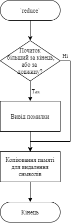
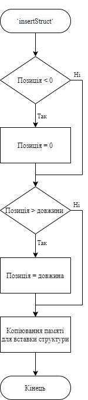
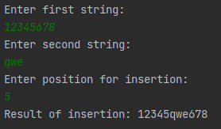
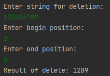

# Лабораторна робота №18. Динамічні масиви.
## Вимоги:
* *Розробник*: Зозуля Ігор студент группи КІТ-120а.
* *Загальне завдання*: Створити функції відповідно до попредньо розлобленого функціоналу.
* *Індивідуальне завдання* : Розробити функції:
    1. Яка реалізує вставку одного рядка в інший.
    2. Яка видаляє з рядка символи в певному діапазоні.
    3. Яка додає елемент до динамічного масиву структур прикладної галузі
## Опис програми:
* *Функціональне призначення* : Видалення та вставка єлементів до різних типів данних.

* *Опис логічної структури* :
    * Функція `main`. Отримує дві строки для вставки та передає їх до функції `insert`; отримує строку для видалення з неї елементів та передає її до функції `reduce`; генерує структуру прикладної галузі, для вставки до масиву за допомогою функції `insertStruct`; викликає функцію `reduceStruct` для видалення структури з масиву. Схема алгоритму функції:

      

    * Функція `insert`. Вставка однієї строки до іншої в певному місці. Схема алгоритму функції:

      

    * Функція `reduce`. Видалення елементів зі строки в певному діапазоні. Схема алгоритму функції:

      

    * Функція `insertStruct`. Вставка структури до масиву структур в певному місці. Схема алгоритму функції:

      

    * Функція `reduceStruct`. Видалення певної структури з масиву. Схема алгоритму функції:

      
    
* *Структура програми*:
```
.
├── assets
│   └── input.txt
├── doc
│   └── lab18.md
├── Doxyfile
├── Makefile
├── README.md
├── src
│   ├── lib.c
│   ├── lib.h
│   └── main.c
└── test
    └── test.c

    
```
* *Важливі елементи програми*:
    * Додавання структури до масиву:

   ```
    memcpy(*result, *watches, sizeof(struct watch) * (unsigned long)position);
	memcpy(*(result + position), insert, sizeof(struct watch));
	memcpy(*(result + position + 1), *(watches + position), (sizeof(struct watch) * (unsigned long)(count - position)));
   ```
    * Видалення структури з масиву:
   ```
    memcpy(*result, *watches, (sizeof(struct watch) * position));
	memcpy(*(result + position), *(watches + position + 1), (sizeof(struct watch) * (count - position - 1)));
   ```
## Варіанти використання:
Для показання результатів роботи програми можна використовувати IDE CLion або консоль системи Linux. Вставка однієї строки в іншу:



Видалення елементів строки в певному діапазоні:



## Висновки:
В результаті виконання роботи я начився працювати з функцією `memcpy`.