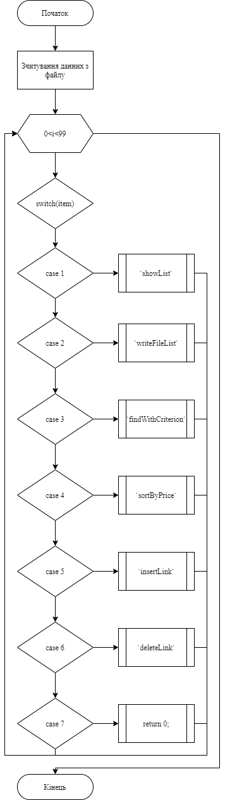
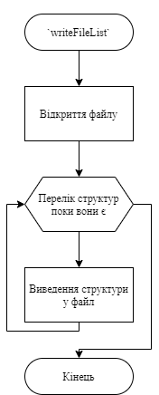
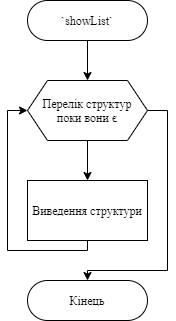
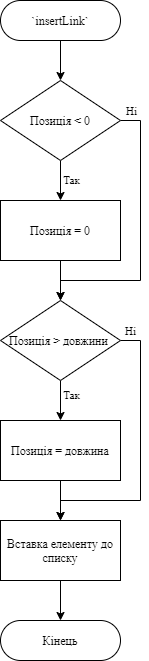
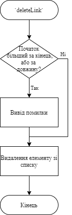
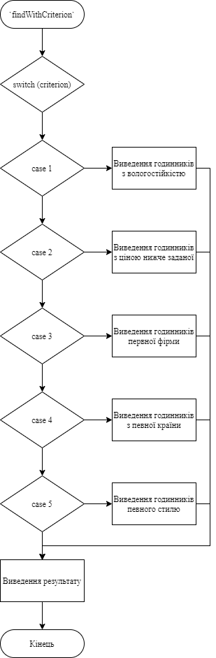
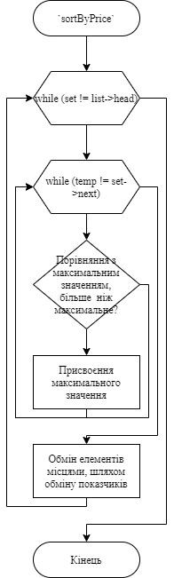
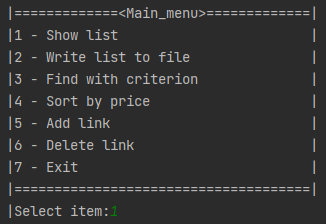

# Лабораторна робота №19. Динамічні списки.
## Вимоги:
* *Розробник*: Зозуля Ігор студент группи КІТ-120а.
* *Загальне завдання*: Сформувати двоспрямований список на базі попередньо розробленого функціоналу.
* *Індивідуальне завдання* : 
    * Реалізувати діалогове вікно.
    * Розробити функції:
    1. Яка читає данні з файлу.
    2. Яка записує данні у файл.
    3. Яка виводить вміст списку на єкран.
    4. Яка шукає об`экт за заданим критерієм.
    5. Яка додає об`экт в будь-яку позицію списку.
    6. Яка видаляє об`экт зі списку.
    7. Яка сортує список за одним з критеріїв.
    
## Опис програми:
* *Функціональне призначення* : Взаємодія з двонаправленим списком прикладної галузі.

* *Опис логічної структури* :
    * Функція `main`. Виводить діалогове вікно з варіантами, які викликають функції `newWatchLink`, `writeFileList`, `showList`, `insertLink`, `deleteLink`, `findWithCriterion`, `sortByPrice`. Схема алгоритму функції:

      

    * Функція `newWatchLink`. Генерує новий список. Схема алгоритму функції:

      

    * Функція `writeFileList`. Записує список до файлу. Схема алгоритму функції:

      

    * Функція `showList`. Виводить список в консоль. Схема алгоритму функції:

      

    * Функція `insertLink`. Додає ланку до списку. Схема алгоритму функції:

      

    * Функція `deleteLink`. Видаляє ланку зі списку. Схема алгоритму функції:

      

    * Функція `findWithCriterion`. Виводить ланки відповідно до критерію. Схема алгоритму функції:

      
    * Функція `sortByPrice`. Сортує список за ціною. Схема алгоритму функції:

      
    
* *Структура програми*:
```
.
├── assets
│   └── input.txt
├── doc
│   ├── assets
│   │   ├── runProg.png
│   │   └── showList.png
│   └── lab19.md
├── Makefile
├── src
│   ├── data.c
│   ├── data.h
│   ├── list.c
│   ├── list.h
│   └── main.c
└── test
    └── test.c


    
```
* *Важливі елементи програми*:
    * Виведення діалогового вікна:

   ```
   printf("\t|=============<Main_menu>=============|\n");
    printf("\t|1 - Show list                        |\n");
    printf("\t|2 - Write list to file               |\n");
    printf("\t|3 - Find with criterion              |\n");
    printf("\t|4 - Sort by price                    |\n");
    printf("\t|5 - Add link                         |\n");
    printf("\t|6 - Delete link                      |\n");
    printf("\t|7 - Exit                             |\n");
    printf("\t|=====================================|\n");
   ```
    * Сортування списку за ціною:
   ```
   struct watchList *set = list->tail;
    while (set != list->head) {
        struct watchList *temp = list->head->next;
        struct watchList *max = list->head;
        while (temp != set->next) {
            if (compare(temp, max) >= 0)
                max = temp;
            temp = temp->next;
        }
        if (set == max) {
            set = max->prev;
            continue;
        } else if (max == list->head && set == list->tail) {
            list->head = set;
            list->tail = max;
            list->head->next = list->tail->next;
            list->tail->prev = list->head->prev;
            list->head->next->prev = list->head;
            list->tail->prev->next = list->tail;
            list->head->prev = NULL;
            list->tail->next = NULL;
        } else if (max == list->head) {
            list->head = set;
            max->prev = list->head->prev;
            list->head->prev = NULL;
            max->prev->next = max;
            struct watchList *t = max->next;
            max->next = list->head->next;
            list->head->next = t;
            max->next->prev = max;
            list->head->next->prev = list->head;
        } else if (set == list->tail) {
            list->tail = max;
            set->next = list->tail->next;
            list->tail->next = NULL;
            set->next->prev = set;
            struct watchList *t = set->prev;
            set->prev = list->tail->prev;
            list->tail->prev = t;
            set->prev->next = set;
            list->tail->prev->next = list->tail;
        } else {
            struct watchList *t = max->next;
            max->next = set->next;
            set->next = t;
            max->next->prev = max;
            set->next->prev = set;
            t = max->prev;
            max->prev = set->prev;
            set->prev = t;
            max->prev->next = max;
            set->prev->next = set;
        }
        set = max->prev;
    }
   ```
## Варіанти використання:
Для показання результатів роботи програми можна використовувати IDE CLion або консоль системи Linux. Запуск програми:



Виведення списку у консоль:


## Висновки:
В результаті виконання роботи я начився створювати та працювати зі списками.