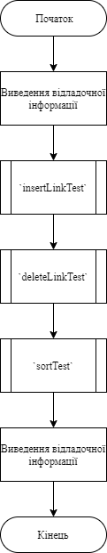
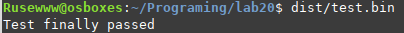
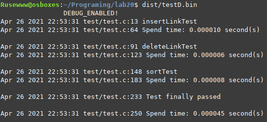

# Лабораторна робота №20. Макровизначення.
## Вимоги:
* *Розробник*: Зозуля Ігор студент группи КІТ-120а.
* *Загальне завдання*: На базі попередньо розробленого функціоналу зробити `DEBUG` режим для модульних тестів.
* *Індивідуальне завдання* : В режимі `DEBUG` программа повина відображати поточну дату та час, назву функції яка виконується, та час її виконання.
    
## Опис програми:
* *Функціональне призначення* : Взаємодія з двонаправленим списком прикладної галузі.

* *Опис логічної структури* :
    * Функція `main`. Виконує тестування функцій файлу list.h. Схема алгоритму функції:

      
    
    
* *Структура програми*:
```
.
├── assets
│   └── input.txt
├── doc
│   ├── assets
│   │   ├── runProg.png
│   │   └── showList.png
│   └── lab19.md
├── Makefile
├── src
│   ├── data.c
│   ├── data.h
│   ├── list.c
│   ├── list.h
│   └── main.c
└── test
    └── test.c


    
```
* *Важливі елементи програми*:
    * Створення макросу:

   ```
   #define al_debug(M, ...) fprintf(stdout, "%s %s %s:%d" M "\n", __DATE__, __TIME__, __FILE__, __LINE__, ##__VA_ARGS__)
   ```
    * Виведення часу витраченого на виконання:
   ```
   #ifdef DEBUG
	printf("\t\tDEBUG_ENABLED!\t\n");
	clock_t begin = clock();
   #endif
   #ifdef DEBUG
	clock_t end = clock();
	double timeInsLink = (double)(end - begin) / CLOCKS_PER_SEC;
	al_debug(" Spend time: %f second(s)\n", timeInsLink);
   #endif
   ```
## Варіанти використання:
Для показання результатів роботи програми можна використовувати IDE CLion або консоль системи Linux. Запуск програми без `DEBUG`:



Запуск программи з `DEBUG`:



## Висновки:
В результаті виконання роботи я начився використовувати макровизначення.