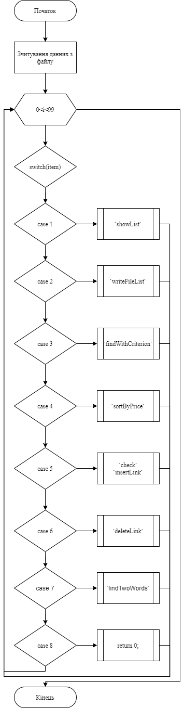
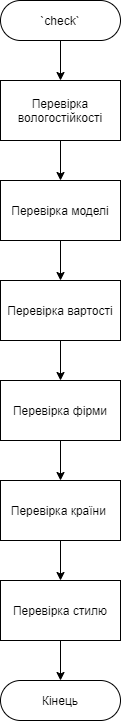
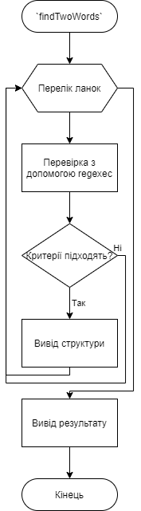
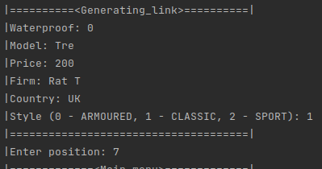
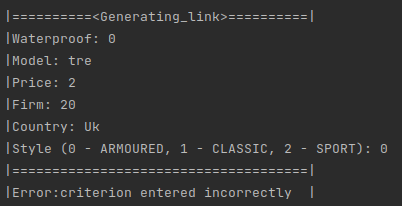
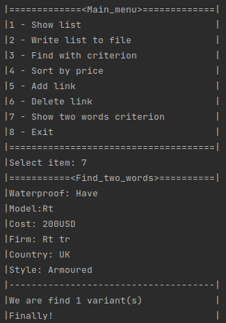

# Лабораторна робота №22. Регулярні вирази.
## Вимоги:
* *Розробник*: Зозуля Ігор студент группи КІТ-120а.
* *Загальне завдання*: Організувати перевірку відповідності критеріям за допомогою регулярних виразів.
* *Індивідуальне завдання* : Розробити функцію яка виводить усі об`єкти які мають поля з двох слів.
    
## Опис програми:
* *Функціональне призначення* : Перевірка відповідності вхідних данних певним критеріям.

* *Опис логічної структури* :
    * Функція `main`. Виводить діалогове вікно з варіантами, які викликають функції `newWatchLink`, `writeFileList`, `showList`, `insertLink`, `deleteLink`, `findWithCriterion`, `sortByPrice`, `check`, `findTwoWords`. Схема алгоритму функції:

      

    * Функція `check`. Перевіряє відповідності вхідних данних певним критеріям. Схема алгоритму функції:

      

    * Функція `findTwoWords`. Виводить усі об`єкти які мають поля з двох слів. Схема алгоритму функції:

      

* *Структура програми*:
```
.
├── assets
│   └── input.txt
├── dist
│   └── testD.bin
├── doc
│   ├── assets
│   │   ├── debugOFF.png
│   │   └── debugON.png
│   └── lab20.md
├── Makefile
├── src
│   ├── data.c
│   ├── data.h
│   ├── list.c
│   ├── list.h
│   └── main.c
└── test
    └── test.c
    
```
* *Важливі елементи програми*:
    * Перевірка відповідності вхідних данних критеріям:

   ```
   bool result = true;
	regex_t regex;
	int resultWp = regcomp(&regex, "^[0-1]$", 0);
	resultWp = regexec(&regex, wp, 0, NULL, 0);
	if (resultWp != 0) {
		result &= false;
	}
	int resultModel = regcomp(&regex, "[A-Z][a-zA-Z]*((( |-|$)?[1-9]{1,4})*|$)?", REG_EXTENDED);
	resultModel = regexec(&regex, model, 0, NULL, 0);
	if (resultModel != 0) {
		result &= false;
	}
	int resultCost = regcomp(&regex, "^[0-9]{1,4}$", REG_EXTENDED);
	resultCost = regexec(&regex, cost, 0, NULL, 0);
	if (resultCost != 0) {
		result &= false;
	}
	int resultFirm = regcomp(&regex, "[A-Z][a-zA-Z]*((( |-|$)?[a-zA-Z])*|$)?", REG_EXTENDED);
	resultFirm = regexec(&regex, firm, 0, NULL, 0);
	if (resultFirm != 0) {
		result &= false;
	}
	int resultCountry = regcomp(&regex, "[A-Z][a-zA-Z]*((( |-|$)?[a-zA-Z])*|$)?", REG_EXTENDED);
	resultCountry = regexec(&regex, country, 0, NULL, 0);
	if (resultCountry != 0) {
		result &= false;
	}
	int resultStyle = regcomp(&regex, "^[0-2]$", 0);
	resultStyle = regexec(&regex, style, 0, NULL, 0);
	if (resultStyle != 0) {
		result &= false;
	}
   ```
## Варіанти використання:
Для показання результатів роботи програми можна використовувати IDE CLion або консоль системи Linux. Введення вірних вхідних данних:



Введення вірних не вхідних данних:



Виведення об`єктів які мають поля з двох слів:



## Висновки:
В результаті виконання роботи я начився використовувати регулярні вирази.