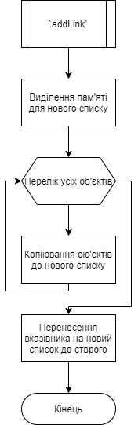

# Лабораторна робота №23. ООП. Вступ до ООП.
## Вимоги:
* *Розробник*: Зозуля Ігор студент группи КІТ-120а.
* *Загальне завдання*: Розробити структори базового классу та його списку.
* *Індивідуальне завдання* : Створити базовий клас годинників.

## Опис програми:
* *Функціональне призначення* : Взаємодія з базовим класом прикладної галузі.

* *Опис логічної структури* :
    * Функція `main`. Виводить список. Викликає функції `addLink`, `showAll`, `findByPrice`, `getLink`, `removeLink`. Схема алгоритму функції:

      

    * Функція `addLink`. Додає класс до списку. Схема алгоритму функції:

      

    * Функція `showAll`. Виводить увесь список. Схема алгоритму функції:

      

    * Функція `findByPrice`. Знаходить усі годиники, ціна яких нижча певної межу. Схема алгоритму функції:

      

    * Функція `getLink`. Повертає вміст классу листа по індексу. Схема алгоритму функції:

      

    * Функція `removeLink`. Видаляє ланцюг классу по індексу. Схема алгоритму функції:

      

* *Структура програми*:
```

```
* *Важливі елементи програми*:
    * Структура базового класу прикладної галузі:

   ```
   class watch {
      private:
	    bool waterproof;
	    string model;
	    int cost;
	    manufacturerStruct manufacturer;
	    watchStyle style;
   };
   ```
    * Структура списку базового класу прикладної галузі:

    ```
    class list {
      private:
	    watch **watches{};
	    int count{};
    };
    ```
## Варіанти використання:
Для показання результатів роботи програми можна використовувати IDE CLion або консоль системи Linux. Результат роботи программи:


Результати роботи тестів:


## Висновки:
В результаті виконання роботи я отримав базові знання ООП на C++.