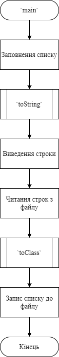
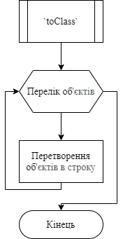
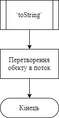
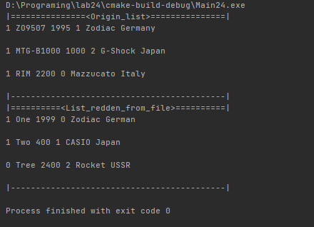
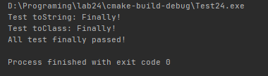

# Лабораторна робота №24. ООП. Потоки.
## Вимоги:
* *Розробник*: Зозуля Ігор студент группи КІТ-120а.
* *Загальне завдання*: Поширити попередню лабораторну роботу таким чином: використання функцій printf/scanf замінити на використання cin/cout; усі конкатенації рядків замінити на використання stringstream; замінити метод виводу інформації про об'єкт на метод, що повертає рядок-інформацію про об'єкт, який далі можна виводити на екран; замінити метод вводу інформації про об'єкт на базі цієї інформації  
* *Індивідуальне завдання* : Створити модульні тести до розробленого функціоналу.
    
## Опис програми:
* *Функціональне призначення* : Взаємодія з базовим класом прикладної галузі.

* *Опис логічної структури* :
    * Функція `main`. Виводить список, зчитує його з файлу. Викликає функції `toClass`, `toString`. Схема алгоритму функції:

      

    * Функція `toClass`. Перетворює рядок в інформацію про об'єкт. Схема алгоритму функції:

      

    * Функція `toString`. Перетворює інформацію про об'єкт в рядок. Схема алгоритму функції:

      
    

* *Структура програми*:
```
.
├── CMakeLists.txt
├── Makefile
├── assets
│   └── input.txt
├── doc
│   ├── assets
│   │   ├── lab24.drawio
│   │   ├── main.png
│   │   ├── run.png
│   │   ├── test.png
│   │   ├── toClass.png
│   │   └── toString.png
│   └── lab24.md
├── src
│   ├── list.cpp
│   ├── list.h
│   ├── main.cpp
│   ├── watch.cpp
│   └── watch.h
└── test
    └── test.cpp
```
* *Важливі елементи програми*:
    * Перетврорення інформації про об'єкт в рядок:

   ```
    stringstream out;
	out << getWaterproof() << " " << getModel() << " " << getCost() << " " << getStyle()<< " " << getManufacturer().getFirm() << " "
	    << getManufacturer().getCountry() << endl;
	return out.str();
   ```
    * Перетврорення рядка в інформацію про об'єкт:

    ```
    string clone = sWatch;
	unsigned long length = sWatch.length();
	string str;
	stringstream buffer;
	int counter = 0;
	unsigned long position = 0;
	watch tmp;
	for (unsigned long i = 0; i < length; ++i) {
		if(sWatch[i] == ' '){
			if (counter == 0){
				position = clone.find(' ');
				str = clone.substr(0, position);
				int waterproof;
				buffer << str;
				buffer >> waterproof;

				tmp.setWaterproof(waterproof);
				clone.erase(0, position + 1);
				buffer.clear();
				counter++;
				position = i;
			}else if (counter == 1){
				position = clone.find(' ');
				str = clone.substr(0, position);
				tmp.setModel(str);
				clone.erase(0, position + 1);
				counter++;
			}else if (counter == 2) {
				position = clone.find(' ');
				str = clone.substr(0, position);
				int cost;
				buffer << str;
				buffer >> cost;
				tmp.setCost(cost);
				clone.erase(0, position + 1);
				buffer.clear();
				counter++;
			} else if (counter == 3){
				position = clone.find(' ');
				str = clone.substr(0, position);
				int style;
				buffer << str;
				buffer >> style;
				switch (style) {
				case 0:
					tmp.setStyle(ARMOURED);
					break;
				case 1:
					tmp.setStyle(CLASSIC);
					break;
				case 2:
					tmp.setStyle(SPORT);
				default:
					break;
				}
				buffer.clear();
				clone.erase(0, position + 1);
				counter++;
			}else if(counter == 4){
				for (unsigned long j = 0; j < clone.length(); ++j) {
					if(clone[j] == ' '){
						position = clone.find(' ');
						string firm = clone.substr(0, position);
						clone.erase(0, position + 1);
						string country = clone.substr(0, position);
						auto *manufacturer = new manufacturerStruct(firm, country);
						tmp.setManufacturer(manufacturer);
						delete manufacturer;
						break;
					}
				}
				break;
			}
		}
	}
	return tmp;
    ```
## Варіанти використання:
Для показання результатів роботи програми можна використовувати IDE CLion або консоль системи Linux. Результат роботи программи:



Результати роботи тестів:




## Висновки:
В результаті виконання роботи я навчився використовувати потока в C++.