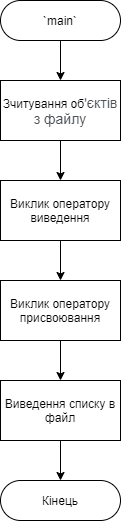
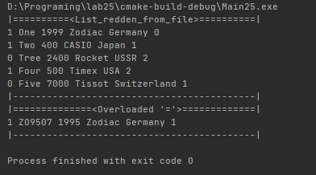
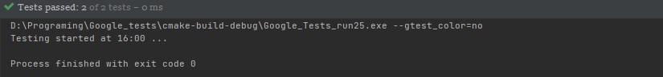

# Лабораторна робота №25. ООП. Перевантаження операторів.
## Вимоги:
* *Розробник*: Зозуля Ігор студент группи КІТ-120а.
* *Загальне завдання*: Перевантажити оператори в базовому класі та класі списку.
* *Індивідуальне завдання* : Перевантажити оператор порівняння.
    
## Опис програми:
* *Функціональне призначення* : Взаємодія з базовим класом прикладної галузі.

* *Опис логічної структури* :
    * Функція `main`. Виводить список, зчитує його з файлу. Викликає оператори `=`, `==`, `>>/<<`, `[]`. Схема алгоритму функції:

      

    * Оператор `=`. Копіює один об'єкт до іншого. Схема алгоритму функції:

      

    * Функція `==`. Порівнює два об'єкти, чи не є вони однаковими. Схема алгоритму функції:

      

    * Функція `<<`. Виводить об'єкти. Схема алгоритму функції:

      

    * Функція `>>`. Зчитує об'єкти. Схема алгоритму функції:

        
    
* *Структура програми*:
```

```
* *Важливі елементи програми*:
    * Перевантаження оператора `==`:

   ```
    bool operator==(watch &watch1, watch &watch2)
    {
        if (watch1.getWaterproof() == watch2.getWaterproof() && watch1.getModel() == watch2.getModel() && watch1.getCost() == watch2.getCost() &&
            watch1.getManufacturer().getCountry() == watch2.getManufacturer().getCountry() &&
            watch1.getManufacturer().getFirm() == watch2.getManufacturer().getFirm() && watch1.getStyle() == watch2.getStyle()) {
                return true;
        } else {
                return false;
        }
    }
   ```
  
## Варіанти використання:
Для показання результатів роботи програми можна використовувати IDE CLion або консоль системи Linux. Результат роботи программи:



Результати роботи тестів:



## Висновки:
В результаті виконання роботи я навчився перевантажувати оператори в C++.