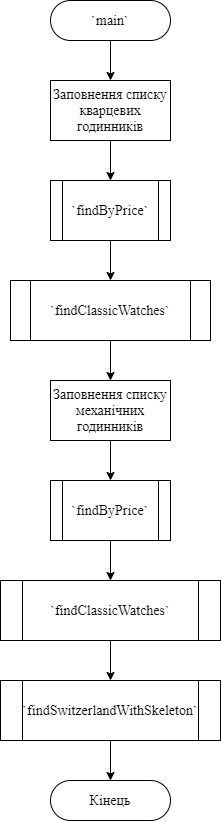
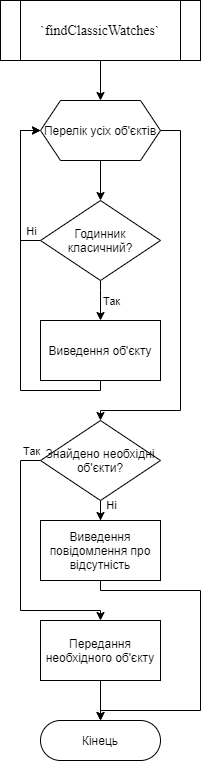
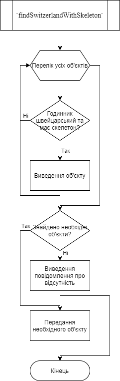
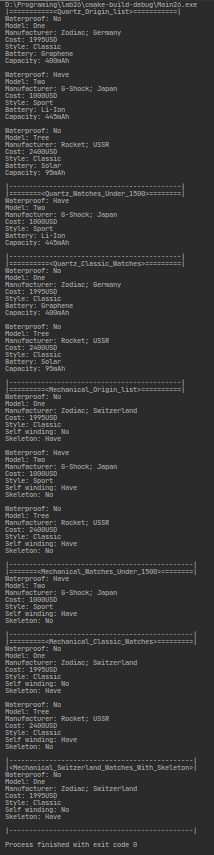
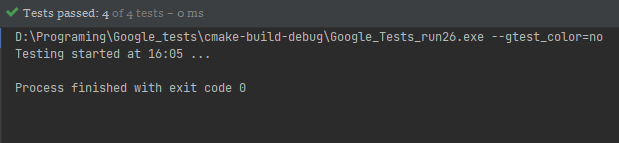

# Лабораторна робота №26. ООП. Спадкування.
## Вимоги:
* *Розробник*: Зозуля Ігор студент группи КІТ-120а.
* *Загальне завдання*: Створення класу спадкоємцю, та классу списків для них.
* *Індивідуальне завдання* : Створення класів спадкоємців для класу годинників.
    
## Опис програми:
* *Функціональне призначення* : Взаємодія з базовим класом прикладної галузі та його спадкоємцями.

* *Опис логічної структури* :
    * Функція `main`. Створює два списки класів спадкоємців та виводить їх вміст. Викликає функції `addLink`, `showAll`, `findByPrice`, `findClassicWatches`, `findSwitzerlandWithSkeleton`. Схема алгоритму функції:

      

    * Оператор `findClassicWatches`. Копіює один об'єкт до іншого. Схема алгоритму функції:

      

    * Функція `findSwitzerlandWithSkeleton`. Порівнює два об'єкти, чи не є вони однаковими. Схема алгоритму функції:

      
    
* *Структура програми*:
```
.
├── CMakeLists.txt
├── Makefile
├── assets
│   └── input.txt
├── doc
│   ├── assets
│   │   ├── findClassicWatches.png
│   │   ├── findSwitzerlandWithSkeleton.png
│   │   ├── lab26.drawio
│   │   ├── main.png
│   │   ├── run.png
│   │   └── test.png
│   └── lab26.md
├── src
│   ├── list.cpp
│   ├── list.h
│   ├── main.cpp
│   ├── watch.cpp
│   └── watch.h
└── test
    └── test.cpp
```
* *Важливі елементи програми*:
    * Один з кассів спадкоємців:

   ```
    class mechanicalWatches : public watch {
      private:
	    bool selfWinding;
	    bool skeleton;
    };
   ```

    * Клас список класу скадкоємця:

   ```
    class quartzWatchesList {
      private:
	    quartzWatches **quartzWatch{};
	    size_t count{};
    };
   ```
  
## Варіанти використання:
Для показання результатів роботи програми можна використовувати IDE CLion або консоль системи Linux. Результат роботи программи:



Результати роботи тестів:



## Висновки:
В результаті виконання роботи я навчився створювати класи спадкоємців в C++.