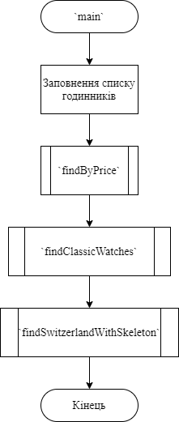
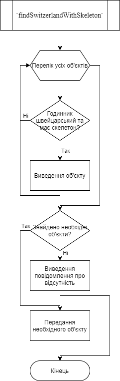
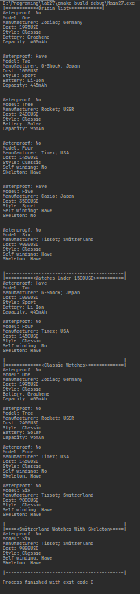
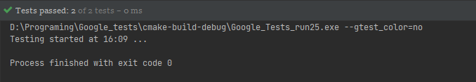

# Лабораторна робота №27. ООП. Поліморфізм.
## Вимоги:
* *Розробник*: Зозуля Ігор студент группи КІТ-120а.
* *Загальне завдання*: Зробити базовий клас абстрактним, розроблені класи списків об'єднуються в один.
* *Індивідуальне завдання* : Створення модульних тестів для перевірки функціоналу.
    
## Опис програми:
* *Функціональне призначення* : Взаємодія з базовим класом прикладної галузі та його спадкоємцями.

* *Опис логічної структури* :
    * Функція `main`. Створює один список класів спадкоємців та виконуэ операції над ними. Викликає функції `addLink`, `showAll`, `findByPrice`, `findClassicWatches`, `findSwitzerlandWithSkeleton`. Схема алгоритму функції:

      

    * Оператор `findClassicWatches`. Копіює один об'єкт до іншого. Схема алгоритму функції:

      

    * Функція `findSwitzerlandWithSkeleton`. Порівнює два об'єкти, чи не є вони однаковими. Схема алгоритму функції:

      
    
* *Структура програми*:
```

```
* *Важливі елементи програми*:
    * Головний клас:

   ```
    class watch {
      public:
	    virtual bool getWaterproof() = 0;
	    virtual string getModel() = 0;
        virtual int getCost() = 0;
	    virtual manufacturerStruct getManufacturer() = 0;
	    virtual watchStyle getStyle() = 0;
	    virtual watch *copy() = 0;
	    virtual void show() = 0;
	    virtual ~watch();
    };
   ```

    * Клас список:

   ```
    class list {
      private:
	    watch **watches{};
	    int count{};

      public:
	    list();
	    list(const list &clone);
	    ~list();
	    void setCount(int countCopy);
	    int getCount() const;
	    void addLink(watch *watchLink);
	    watch *getLink(int index) const;
	    watch *findByPrice(int price) const;
	    watch *findClassicWatches() const;
	    watch *findSwitzerlandWithSkeleton() const;
	    void showAll() const;
    };
   ```
  
## Варіанти використання:
Для показання результатів роботи програми можна використовувати IDE CLion або консоль системи Linux. Результат роботи программи:



Результати роботи тестів:



## Висновки:
В результаті виконання роботи я навчився створювати абстрактні класи в C++.