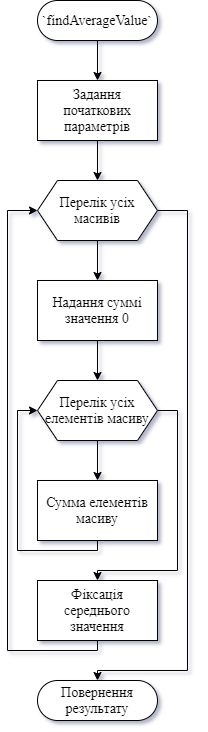
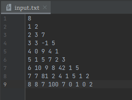
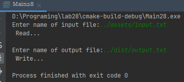
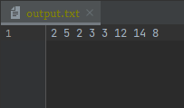
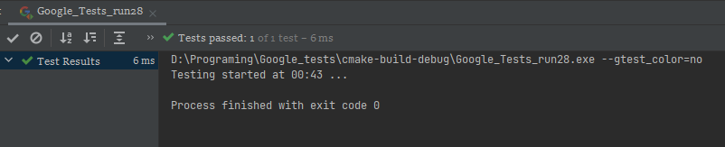

# Лабораторна робота №28. Обробка виключних ситуацій.
## Вимоги: 
* *Розробник*: Зозуля Ігор студент группи КІТ-120а.
* *Загальне завдання*: Необхідно реалізувати програму, що виконує перераховані нижче дії: введення з клавіатури назви вхідного файлу з даними; читання даних з файлу; виконання індивідуального завдання; введення з клавіатури вихідного файлу; запис результату операції у файл; доступ до елемента за індексом слід винести в окрему функцію, що виконує перевірку на можливість виходу за межі масиву. При обробці виключень цикл не повинен перериватись.
* *Індивідуальне завдання* : Знайти середнє значення елементів масиву.
    
## Опис програми:
* *Функціональне призначення* : Загальне завдання виконується за допомогою розроблених методів:
``` 
    void readFromFile();
    void writeToFile();
    string getFileName() const;
    void setFileName(string FName);
    int *getResult();
    void setResult(int *res);
    int getSize(int arrIndex);
    int getElem(int arrIndex, int index);
    void setSize(int arrIndex, int val);
    void setElem(int arrIndex, int index, int val);
```

* *Опис логічної структури* :
    * Метод `int* findAverageValue()`. Знаходить середнє значення елементів масиву. Схема алгоритму функції:

      
    
* *Структура програми*:
```

```
* *Важливі елементи програми*:
    * Перевірка на коректність вхідних з файлу даних:

    ```
     list::readFromFile() {
    ifstream fin;
    fin.exceptions(ios_base::failbit | ios_base::badbit);
    fin.open(fileName, ios_base::in);
    fin >> count;
    if (count < 0) {
        throw invalid_argument("Invalid argument!");
    }
    ```
  *Метод для виконання індивідуального завдання*:
  ```
  int *temp_res = new int[count];
    int sum;
    for (int i = 0; i < count; i++) {
        sum = 0;
        for (int j = 0; j < getSize(i); j++) {
            sum += getElem(i, j);
        }
        temp_res[i] = sum / getSize(i);
    }
    return temp_res;
  ```
## Варіанти використання:
Для показання результатів роботи програми можна використовувати IDE CLion або консоль системи Linux. Результат роботи программи:
* Приклад вхідного файлу:



* Запуск програми: 



* Результат виконання програми записаний у файл:



Результати роботи тестів:



## Висновки:
В результаті виконання лабораторної роботи, було отримано навички у роботі з обробкою виключних ситуацій, "кидати" виключення, та "відловлювати" їх.