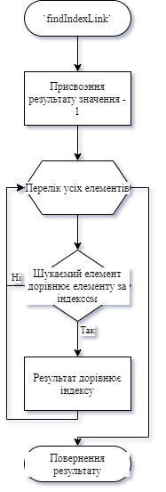
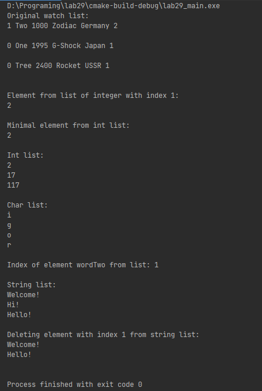
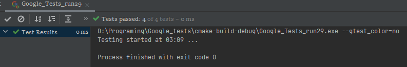

# Лабораторна робота №29. Шаблонні функції та класи.
## Вимоги:
* *Розробник*: Зозуля Ігор студент группи КІТ-120а.
* *Загальне завдання*: Створити, шаблонний клас та наступні методи:
  Вивод вмісту масиву на екран;
  Визначення індексу переданого елемента в заданому масиві;
  Відсортувати елементи масиву;
  Визначити значення мінімального елементу масиву;
  Додати елемент до кінця масиву;
  Видалити елемент з масиву за індексом.
    
## Опис програми:
* *Функціональне призначення* : Загальне завдання виконується за допомогою розроблених шаблонних методів.

* *Опис логічної структури* :
    * _Функція:_  `findIndexLink`: Знаходить в списку індекс заданого елементу. Схема алгоритму метода:

        
    
    *_Функція_ `addLink` Додає новий елемент в кінець списку.

    *_Функція_   `getLink` Повертає елемент зі списку за заданим індексом

    *_Функція_   `deleteLink`.  Видаляє елемент із списку за індексом

    *_Функція_   `findMinLink`,  Повертає значення мінімального елемента

    *_Функція_  `findIndexLink`, Повертає індекс заданого елемента

    *_Функція_   `sortList`,   Сортує список від меншого до більшого

    *_Функція_   `showList` Виводить вміст списку на екран
    
* *Структура програми*:
```

```
* *Важливі елементи програми*:
    * Функція пошуку індексу заданого елемента:

   ```
    int findIndexLink(Type &element){
        int result = -1;
        for (int i = 0; i < index; ++i) {
            if (*elements[i] == element){
                result = i;
            }
        }
        return result;
    };
   ```
  
## Варіанти використання:
Для показання результатів роботи програми можна використовувати IDE CLion або консоль системи Linux. Результат роботи программи:



Результати роботи тестів:



## Висновки:
В результаті виконання роботи я навчився створювати абстрактні класи в C++.