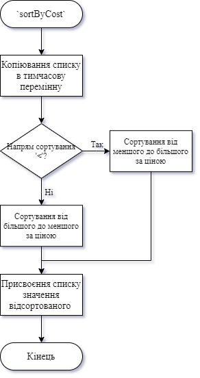
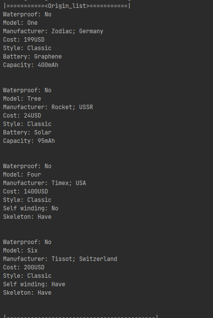
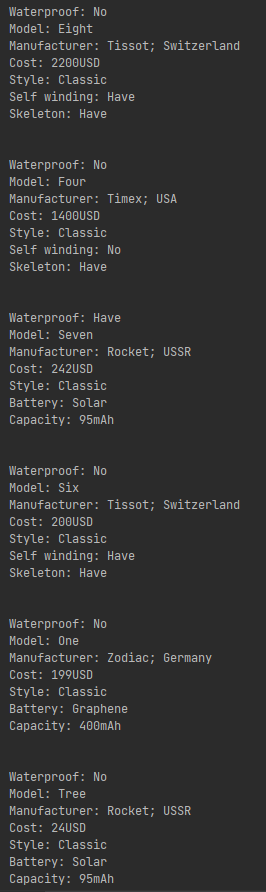
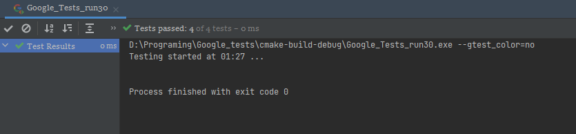

# Лабораторна робота №30. STL. Вступ до Стандартної бібліотеки шаблонів(частина 1).
## Вимоги:
* *Розробник*: Зозуля Ігор студент группи КІТ-120а.
* *Загальне завдання*: Поширити, лабораторну роботу №27 таким чином: Замінити масив та CRUD методи роботи з ним на використання STL; Оновити всі методи роботи з колекцією на використання STL; Додати функцію сортування колекції з використанням функтора; Додати функцію об'єднання двох класів-списків.
* *Індивідуальне завдання* : Виконати завдання, згідно варіанту.
    
## Опис програми:
* *Функціональне призначення* : Загальне завдання виконується за допомогою розроблених методів.

* *Опис логічної структури* :
    * Функція `vector<watch *> findByPrice()`. Знаходить годинники з ціною нижче за 400USD.

    * Оператор `vector<watch *> findClassicWatches()`. Знаходить всі класичні годинники.

    * Функція `vector<watch *> findSwitzerlandWithSkeleton()`. Знаходить всі швейцарські годинники зі скелетоном. 

    * Функція `void sortByCost(char way)`. Сортує контейнер за ціною та напрямком який задає користувач. Схема алгоритму функції:

      

* *Структура програми*:
```

```
* *Важливі елементи програми*:
    * *Функція знаходження годинників*:
      * З ціною нижче за 400USD:
        ```
          vector<watch *> list::findByPrice() {
            vector<watch *> result;
            vector<watch *> tmp = this->watches;
            bool flag = true;
            auto iter = tmp.begin();
            while (true) {
                iter = find_if(iter, tmp.end(), findPriceHelp);
                    if (iter == tmp.end()) {
                        break;
                    }
                flag = false;
                result.push_back((watch *) *iter);
                ((watch *) *iter)->show();
                cout << endl;
                iter++;
            }
            if (flag) {
                cout << "|There are no suitable watches!" << endl;
            }
            while (!tmp.empty()) {
            tmp.pop_back();
          }
          tmp.clear();
          tmp.shrink_to_fit();
          return result;
        }  
        ```
      * Класичні годинники:
        ```
        vector<watch *> list::findClassicWatches() {
            vector<watch *> result;
            vector<watch *> tmp = this->watches;
            bool flag = true;
            auto iter = tmp.begin();
            iter = find_if(iter, tmp.end(), findClassicHelp);
            if (iter == tmp.end()) {
                break;
            }
            flag = false;
            result.push_back((watch *) *iter);
            ((watch *) *iter)->show();
            cout << endl;
            iter++;
            }
            if (flag) {
                cout << "|There are no suitable watches!" << endl;
            }
            while (!tmp.empty()) {
                tmp.pop_back();
            }
            tmp.clear();
            tmp.shrink_to_fit();
            return result;
        }
        ```
      * Швейцарські годинники зі скелетоном:

        ```
        vector<watch *> list::findSwitzerlandWithSkeleton() {
            vector<watch *> result;
            vector<watch *> tmp = this->watches;
            bool flag = true;
            auto iter = tmp.begin();
            while (true) {
                iter = find_if(iter, tmp.end(), findSwitzerlandWithSkeletonHelp);
                if (iter == tmp.end()) {
                    break;
                }
                flag = false;
                result.push_back((watch *) *iter);
                ((watch *) *iter)->show();
                cout << endl;
                iter++;
            }
            if (flag) {
                cout << "|There are no suitable watches!" << endl;
            }
            while (!tmp.empty()) {
                tmp.pop_back();
            }
            tmp.clear();
            tmp.shrink_to_fit();
            return result;
        }
        ```
## Варіанти використання:
Для показання результатів роботи програми можна використовувати IDE CLion або консоль системи Linux. Результат роботи программи:



Демонстрація методу сортування:



Результати роботи тестів:



## Висновки:
В результаті виконання роботи ми навчилися працювати зі стандартною бібліотекою шаблонів, з STL-контейнерами та їх методами і функціями.